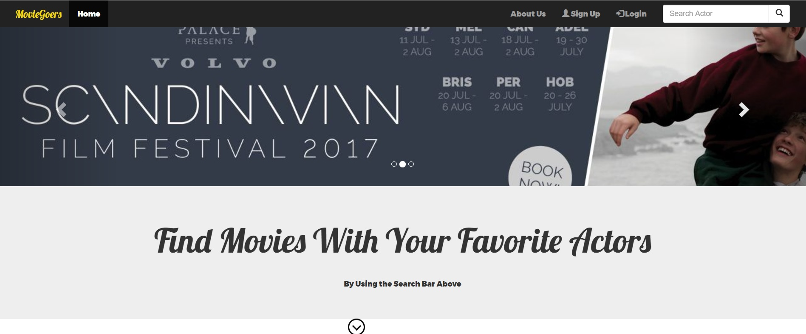

# Movie Goers
Rutgers Coding Bootcamp Project 2

## Overview
A web page that lets users search for movies, get info about them, and store movies they want to watch on their own watchlist.

## Home Page

## Functionality
The front end is built with `HTML`, `CSS`, `Bootstrap`, and `Handlebars`. `The Movie Database` API is used to get movie information. The back end is built with `Node`, `Express`, and `Sequelize`. User authentication is done with `Passport`. 

## Tech used

    "HTML": "5",
    "CSS": "3",
    "Bootstrap": "3.3.7",
    "JavaScript": "ECMA-262",
    "jQuery": "3.2.1",
    "Node": "6.11.0 LTS",
    "Express": "4.15.3",
    "Handlebars": "3.0.0",
    "Sequelize": "4.3.2",
    "MySQL": "5.7.18",
    "Passport": "0.3.2"

## Authors
*Rutgers Codding Bootcamp Project*
* **Tarek** - [Tarek](https://github.com/Tarek731)
* **Parendu** - [Parendu](https://github.com/parendu)
* **Joseph** - [josephtball](https://github.com/josephtball)
